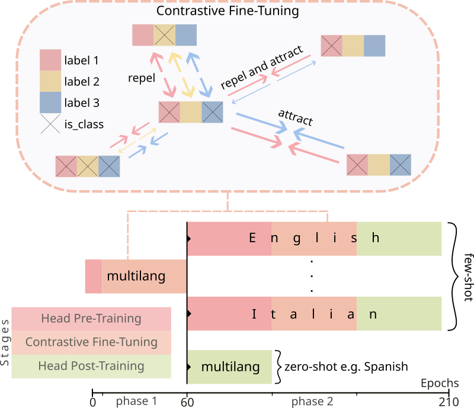

# Contrastive Pre-Training of Transformer Models for Computational Framing Analysis
This repository contains the notebooks and mCPT framework used in [mCPT at SemEval-2023 Task 3](https://aclanthology.org/2023.semeval-1.130/) as well as within the context of my [thesis](thesis.pdf).
Notebooks 0x contain an analysis of the data and notebooks 3x and 4x correspond to the sections methodology and results in my thesis. `mcpt` contains the _mCPT_
pyTorch framework.

_Ertl, A., Reiter-Haas, M., Innerebner, K., and Lex, E. (2023). mCPT at SemEval-2023 Task 3: Multilingual Label-Aware Contrastive Pre-Training of Transformers for Few- and Zero-shot Framing Detection. In Proceedings of the 17th International Workshop on Semantic Evaluation (SemEval-2023), pages 941–949, Toronto, Canada. Association for Computational Linguistics._

## Datasets
- GVFC _(Liu, S., Guo, L., Mays, K., Betke, M., and Wijaya, D. T. (2019). Detecting frames in news headlines and its application to analyzing news framing trends surrounding us gun violence. In Proceedings of the 23rd conference on computational natural language learning (CoNLL), pages 504–514.)_
- LOCO _(Miani, A., Hills, T., and Bangerter, A. (2021). LOCO: The 88-million-word language of conspiracy corpus. Behavior Research Methods, 54(4):1794–1817.)_
- SemEval _(Piskorski, J., Stefanovitch, N., Da San Martino, G., and Nakov, P. (2023). Semeval-2023 task 3: Detecting the category, the framing, and the persuasion techniques in online news in a multi-lingual setup. In Proceedings of the 17th International Workshop on Semantic Evaluation, SemEval 2023, Toronto, Canada.)_
- US-Economic-News.csv _(https://www.kaggle.com/datasets/heeraldedhia/us-economic-news-articles)_
